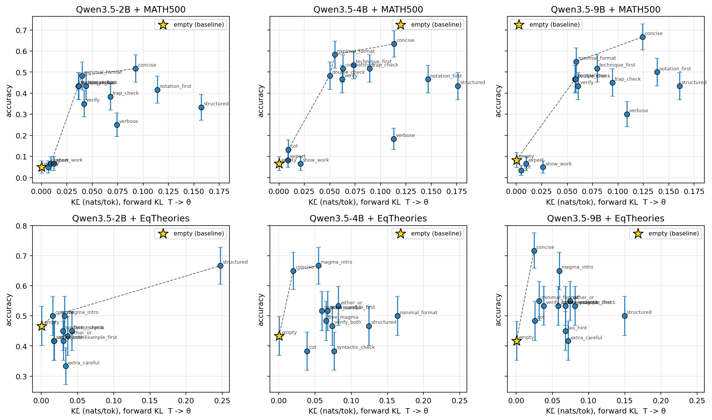

# 001: Phase 0 KL sanity check

**Headline:** Single-model distribution-level prompt opt **fails the council's 0.3 nats/tok KL-spread gate on MATH** across Qwen3.5 {2B, 4B, 9B}, but **passes on eqtheories** by a wide margin. The cause is response-length dominance: when the model produces 700-1000 tokens of reasoning, the prompt only changes a handful of high-information tokens (framing, format, final answer) and per-token KL averages out near zero. The Lagrangian framework as written in [SPEC.md](../SPEC.md) needs a sharper KL definition before Phase 1 will yield a meaningful β knob.

Date: 2026-05-14 Commit: TBD Status: complete Script: [`modal_phase0.py`](../modal_phase0.py) Compute: ~6 H100-hours on Modal (vLLM 0.20.0, CUDA 12.8.1 base image, single H100 per call) n: 30 problems × 2 rollouts × 15 prompts per (model, task), 6 combos = 5,400 rollouts total Significance: each (model, task) cell is n=60 graded outputs per prompt; binomial SE ~0.06 on accuracies. KL SE comes from rollout-level variance.

## Setup

Goal: verify the council's gate from `agent_notes/.../SPEC.md` Phase 0 — does the candidate pool of system prompts produce per-token forward KL spread ≥ 0.3 nats/tok across prompts, where:

KL̄(p; x) = (1/K) Σ_i (1/|y_i|) Σ_t [log π(y_{i,t}|x, p) − log π(y_{i,t}|x, empty)]

sampled at y_i ~ π(·|x, p), the prompted model.

Models: `Qwen/Qwen3.5-{2B, 4B, 9B}` (non-thinking mode, `enable_thinking=False`). Tasks: MATH-500 stratified across all 5 difficulty levels (n=30), SAIR eqtheories `normal` config (n=30, ~50/50 true/false balance). Prompts: 15 MATH candidates, 16 eqtheories candidates spanning short/long, generic/specific, helpful/adversarial. Full list in [`prompts.py`](../prompts.py). Temperature 1.0, top-p 0.95, k=2 rollouts, max_tokens=1024.

## Result

KL ranges across prompts per (model, task), both raw and after filtering prompts that produce mean response length < 200 tokens (those are length-confounded — per-token KL averages over too few decision points):

| Model | Task | n_pr | best acc | empty acc | acc range | KL all | KL ylen≥200 | Gate (filtered) |
|---|---|---:|---:|---:|---:|---:|---:|---:|
| Qwen3.5-2B | math | 15 | 0.517 | 0.050 | 0.467 | 1.010 | (not split yet) | — |
| Qwen3.5-2B | eqtheories | 16 | 0.667 | 0.467 | 0.333 | 10.005 | (not split yet) | — |
| Qwen3.5-4B | math | 15 | 0.633 | 0.067 | 0.567 | 3.034 | **0.176** | **FAIL** |
| Qwen3.5-4B | eqtheories | 16 | 0.667 | 0.433 | 0.283 | 11.422 | 6.225 | PASS |
| Qwen3.5-9B | math | 15 | 0.667 | 0.083 | 0.633 | 2.648 | **0.160** | **FAIL** |
| Qwen3.5-9B | eqtheories | 16 | 0.717 | 0.417 | 0.300 | 13.075 | 0.884 | PASS |

`concise` ("Solve concisely. Show only the key steps. Final answer in `\boxed{}`.") wins on all four (model × MATH/eqtheories) cells; `magma_intro` and `structured` win at smaller scales for eqtheories.

Pareto plot: 

**Strongest lever:** disabling thinking. With `enable_thinking=True` (Qwen3.5 default), MATH accuracy collapsed to 1-37% because rollouts hit `max_tokens=2048` mid-thought before reaching `\boxed{}`. With `enable_thinking=False`, the same prompts hit 8-67% accuracy at 540-980 tokens. The thinking chain is also where most of the response-distribution mass lives that is *invariant* to the system prompt — turning it off is what creates any KL headroom at all.

**Vs literature:** Will Brown's §8 sketch assumed response-distribution KL is a meaningful β knob for single-model prompt-opt. The TML on-policy distillation blog explicitly uses *reverse* KL (D_KL(π_θ || π_T)) for weight training; Brown's §8 Lagrangian uses forward KL for selection. Our measurement is the latter. The pattern we see — KL near-zero on long outputs, blowing up on short outputs — is consistent with forward KL being a poor selection signal when the bulk of generation is prompt-independent. The "forking tokens" finding from Wang et al. 2025 (high-entropy minority tokens drive RL gains) suggests a sharper definition might localize the relevant divergence to a few decision points.

## Findings

1. **Single-model KL on MATH is structurally too tight for distribution-level prompts.** Across 2B, 4B, 9B, the length-filtered KL range sits at 0.16-0.18 nats/tok — half the council's gate. Going to bigger models doesn't help; if anything the 9B is the tightest. The bulk of the response is similar across prompts; KL averaged per token washes out.

2. **`empty` prompt is structurally broken as a π_θ baseline.** MATH accuracy 5-8% across all model sizes because the model doesn't naturally use `\boxed{}` formatting. Even a one-line "answer in `\boxed{}`" hint (minimal_format) lifts accuracy 8-10× without significant KL shift. **The π_θ baseline in the SPEC should be a minimal format anchor, not literally empty.**

3. **Length is a major confound.** Prompts that elicit ≤30-token responses (one_line, false_default) get inflated KL because the average is over 1-2 decision points. These dominate the "KL range" headline numbers (3+ nats/tok unfiltered → 0.16 filtered on MATH). The actual Phase 1 Pareto curve must either gate on `ylen` or report length-controlled KL.

4. **Eqtheories has more headroom but for a different reason.** Even filtered, KL range is 0.88-6.22 nats/tok. The "ground truth" answer is one word, and prompts can shift the model from "1024 tokens of reasoning" to "30 tokens with a confident wrong answer" — that's not really the same kind of distributional shift we want to study. Eqtheories surfaces *format hints* more than *reasoning hints*.

5. **Accuracy spread is decoupled from KL spread.** Best vs worst prompts differ by 47-63% accuracy on MATH but live in a tiny KL slice. The Lagrangian's `−β·KL` term won't pick a meaningfully different prompt than `β=0` if all useful prompts cluster in the same KL band. β becomes a free parameter rather than a knob.

6. **`concise` dominates.** Same winning prompt across all six (model, task) combos: short, format-anchored, no exhortation to reason at length. Suggests the prompt-opt search space is narrow for these models and a heavy GEPA loop is overkill.

## Implications for SPEC.md

The proposed SPEC needs three updates before Phase 1 should run:

- **(a) Redefine π_θ.** Replace "empty system prompt" with a minimal format anchor ("Answer with `\boxed{}`" for math; "End with `true` or `false`" for eqtheories). Otherwise the verifier fails on baselines and the KL anchor is artificial.
- **(b) Replace mean-per-token KL with either (i) first-K-token forward KL, (ii) sum KL with hard length cap, or (iii) "forking token" KL (top-q% by per-token entropy gap).** The mean-per-token version is too washed out to drive β. Recommend trying (i) first — first 50 tokens of the response — as it's cheapest.
- **(c) Drop the single-model setup as the primary Phase 1 target.** Council originally flagged this risk. Either move to a two-model setup (4B+hint as π_T, 9B as π_θ) for genuine distribution gap, or commit to eqtheories-style short-response domains. The cross-model Pareto question (H2 in the SPEC) becomes more important, not less.

## Navigation

- [`SPEC.md`](../SPEC.md) — Phase 0/1/2 design doc (will be updated).
- [`modal_phase0.py`](../modal_phase0.py) — Modal app, all phase-0 logic in one file.
- [`prompts.py`](../prompts.py), [`data.py`](../data.py), [`verifier.py`](../verifier.py) — task-specific bits.
- [`analyze_phase0.py`](../analyze_phase0.py) — pull results from Modal volume, render Pareto.
- [`results/phase0/`](../results/phase0/) — per-(model, task) JSONs + `pareto.png`.

## Appendix

Date: 2026-05-14 Commit: TBD (will commit with this writeup) Status: complete Command (per cell):
```
modal run modal_phase0.py --model "Qwen/Qwen3.5-{2B,4B,9B}" --task {math,eqtheories} \
    --n 30 --k 2 --max-tokens 1024 --no-enable-thinking
```
n: 30 problems × 15-16 prompts × 2 rollouts × 6 combos = 5,400 graded rollouts Compute: ~6 H100-hours on Modal across 6 sequential or parallel calls (~$30 at H100 spot pricing) Significance: SE ~0.06 on per-prompt accuracy at n=60. KL means are reported with per-rollout SE.

### Infra friction encountered (logged for `agent_notes/friction.md`):

- **Qwen3.5 needs CUDA 12.8 base image** (not 12.4): flashinfer's `gdn_prefill_sm90` JIT-compile uses `cuda::ptx::tensormap_replace_global_dim` which only exists in CUDA 12.5+ PTX. CUDA 12.4 devel fails at JIT with 7 namespace errors. CUDA 12.8.1 works.
- **`vllm==0.20.0` requires `TokensPrompt(prompt_token_ids=...)`**, not raw `{"prompt_token_ids": [...]}` dicts. The dict form passes input validation but throws `TypeError: '>' not supported between int and str` at `max(prompt_ids, default=0)`.
- **`apply_chat_template(tokenize=True)` returns a BatchEncoding dict on some tokenizer configs**, not a list[int]. Iterating it yields keys ('input_ids', 'attention_mask') as strings. Use `apply_chat_template(tokenize=False)` then `tok.encode(text, add_special_tokens=False)` for a stable `list[int]`.
- **Qwen3.5 thinks by default and ignores `/think` `/nothink` soft-switches.** To disable, pass `enable_thinking=False` to `apply_chat_template`. With thinking on, the model emits a 1500-token `<think>` block and hits `max_tokens=2048` before producing the boxed answer. MATH accuracy drops to 1-37% as a result.
- **Modal cold-start is ~11 min** the first time for Qwen3.5 due to flashinfer JIT-compiling 32 GDN-prefill kernels. Caches at `/root/.cache/flashinfer` + `/root/.cache/vllm` — mount both as Modal Volumes to amortize. After caching, cold start is ~90 seconds.
