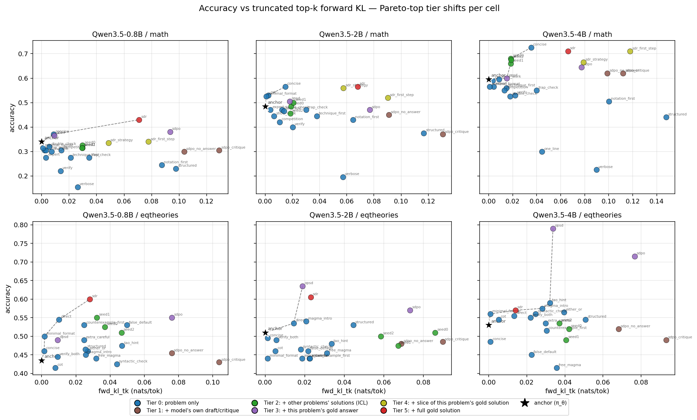

# 002: No single information tier wins the teacher-context Pareto

**Takeaway:** The best teacher context is **cell-specific** — across 6 (model, task) cells the Pareto-top condition lands on 4 different information tiers. Two decisions fall out: (1) **self-distillation without gold info (own draft / own critique) is not worth it** — it underperforms a plain engineered prompt on every cell and *hurts* accuracy on weak-model × math. (2) For a cross-cell selection rule you cannot threshold on KL with one β; the Pareto-top tier moves per cell, so selection must be Pareto-curve-based. Practical wins: `distrib:concise` is the best leak-free choice for MATH everywhere; the gold answer (OPSD/SDPO) is the most reliable lift when you can use it (+3 to +26pp on 5/6 cells).

## Setup

- **Objective tested:** Brown's Lagrangian `max_p E[acc] − β·E[D_KL(π_T(·|x,c) || π_θ(·|x))]`. Does any teacher context `c` give high accuracy at low KL from the unprompted policy, and does the same choice transfer across cells?
- **Information-tier framing** (the axis the Lagrangian is sensitive to — group by what `c` knows about the current problem beyond its statement, not by family name):
  - Tier 0 — problem only: `anchor`, `distrib:*` (14-15 engineered prompts)
  - Tier 1 — model's own draft / self-critique: `sdpo_no_answer`, `sdpo_critique`
  - Tier 2 — *other* problems' gold solutions (k=2 ICL demos): `sdft:seed{0,1,2}`
  - Tier 3 — this problem's gold answer: `opsd` (answer only), `sdpo` (answer + draft)
  - Tier 4 — slice of this problem's gold solution (MATH only): `sdr_strategy`, `sdr_first_step`
  - Tier 5 — full gold solution: `sdr`
- **Models × tasks (6 cells):** Qwen3.5-{0.8B, 2B, 4B} × {MATH-500 n=50 stratified, SAIR eq-theories n=50}. Non-thinking mode.
- **π_θ anchor (KL reference):** minimal format prompt only (`"Solve... End with \boxed{answer}."` / `"Decide... End with true/false."`). All conditions layer `c` on this.
- **Rollouts:** K=4 from π_T, K=4 shared anchor rollouts (also used as SDPO drafts). Every rollout cross-scored under both contexts via vLLM `prompt_logprobs=20`. Per-token KL in three estimators (k1 naive / k3 Schulman / tk truncated top-20 analytic), `y_len ≥ 200` filter.
- **Infra:** Modal H100. Required workarounds for a vLLM-0.20 V1 deadlock on Qwen3.5 (no prefix caching + eager + triton GDN backend) — see friction.md; ~$25 debug compute.

## Result

Per-cell winner and the best accuracy within each tier (`–` = tier N/A; ↓ = below anchor). Anchor is the no-`c` baseline.

| Cell | anchor | T0 | T1 | T2 | T3 | T4 | T5 | winner (tier) |
|---|---:|---:|---:|---:|---:|---:|---:|---|
| 0.8B/math | .315 | .350 | .305↓ | .360 | .360 | .380 | **.440** | sdr (T5) |
| 0.8B/eq | .395 | .560 | .460 | .530 | .505 | – | **.570** | sdr (T5) |
| 2B/math | .525 | **.585** | .535 | .500↓ | .590 | .550 | .565 | distrib:concise (T0) |
| 2B/eq | .450 | .540 | .535 | .505 | **.610** | – | .565 | sdpo (T3) |
| 4B/math | .620 | .695 | .640 | .680 | .645 | **.710** | .700 | sdr_first_step (T4) |
| 4B/eq | .505 | .565 | .550 | .540 | **.760** | – | .530↓ | opsd (T3) |

The Pareto-top tier is T5, T5, T0, T3, T4, T3 — no tier wins twice with the same task. KL story: per-token `fwd_kl` is washed out everywhere (≤0.09 nats/tok even at full-solution leak); `fwd_kl_first32` separates tiers (T1 long critiques 0.4-0.7; T0 best-distrib 0.06-0.20).

**KL estimator (k1 → k3 → tk).** The original k1 (`log π−log q` at the sampled token) is unbiased but sign-indefinite: 2-3 conditions per cell read negative rev_kl (an MC artifact on answer-leaking teachers, not a real lower-bound violation). Re-ran all 6 cells with `prompt_logprobs=20` and two better estimators: **k3** (Schulman; same expectation, ≥0 pointwise) and **tk** (truncated analytic KL summed over the top-20 next-token dist per position; lowest variance, only truncation bias). Both eliminate every negative (0/— across all cells). Crucially the decision is unchanged: Spearman(acc, KL) on distrib shifts ≤0.06 vs k1 in every cell (e.g. 4B/math −0.74 → −0.75). The plot and frontier above use **tk**; k1's negatives were noise, not signal.

**Strongest lever:** the gold answer (Tier 3). OPSD/SDPO lifts on 5/6 cells, +3 to +26pp; the lone miss is 2B/math where `distrib:concise` edges it. Among leak-free options the best Tier-0 prompt beats the best Tier-1 self-distillation variant on **every** cell.

**Vs literature:**

- **Hübotter (SDPO, 2601.20802):** "drafts + feedback drive distillation" does not generalize here — draft-only and draft+self-critique underperform plain prompts; the lift only returns when the gold answer is added back.
- **Zhao (SDR, 2601.18734):** full-solution leak helps most on 0.8B/math (+13pp); on 4B/math the *first paragraph* (`sdr_first_step`, .710) matches the full chain (.700) — most of the SDR win is the first step, not the whole solution.
- **Shenfeld (SDFT, 2601.19897):** k=2 ICL lifts +4-14pp but varies 2-8pp by demo seed within a cell — not a free knob.
- **Brown §8:** the single-β Pareto-traversal assumption fails; the Pareto-top tier shifts per cell.

## Key findings

1. **No tier dominates across cells** — the right `c` is cell-specific (T5 for 0.8B, T3 for capable-model eq, T0 for 2B/math, T4 for 4B/math).
2. **Tier 1 (self-distillation, no gold) is the weakest above anchor** — beaten by the best engineered prompt everywhere; *hurts* 0.8B/math (−6pp) and 2B/math (−11pp, the largest single regression).
3. **Self-critique is high-variance** — helps capable-model or binary-task cells (+2-9pp), hurts weak-model × open-ended math.
4. **`distrib:concise` is the leak-free MATH winner** on all 3 MATH cells (matches Phase 0).
5. **OPSD > SDPO on 4B/eq by 9pp** — once the model is capable on a binary task, the injected draft anchors it to its own (often wrong) verdict.
6. **`sdr_first_step` ≈ `sdr` on 4B/math** — first paragraph carries the signal; *caveat:* extraction is leak-noisy (2/5 sampled problems leak the answer in the first sentence — see lessons.md), so interpret T4 as a noisy mid-tier, not a clean "strategy hint".

## Implications for next steps

- **Lagrangian selection:** must be Pareto-curve-based (pick a frontier point), not a single-β KL threshold.
- **Phase 2 (OPD):** add `sdr_first_step` to the 5-point teacher-context selection — it's the most information-efficient interpolation point on MATH.
- **Self-distillation follow-up:** the critique pass is the variance source; a critique-then-vote or multi-critique scheme is the obvious lever to test next.

## Navigation

- [`SPEC.md`](../SPEC.md) · [`001_phase0_kl_sanity.md`](001_phase0_kl_sanity.md) (motivating sanity check)
- [`agent_notes/friction.md`](../agent_notes/friction.md): vLLM-0.20 Qwen3.5 deadlock workarounds.
- [`agent_notes/lessons.md`](../agent_notes/lessons.md): SDR framing, extraction-noise, KL-washout.
- [`teacher_contexts.py`](../teacher_contexts.py) (24 builders) · [`results/phase1/`](../results/phase1/) (per-cell JSON + Pareto plots).

## Appendix

Date: 2026-05-14 (v6); KL-estimator re-run 2026-05-16 (v7, prompt_logprobs=20 + k3/tk) Commit: 4c46fa1 (Phase 1 implementation uncommitted at writeup time) Status: complete; v7 final (6/6 cells, k1/k3/tk estimators) Command: `modal run --detach modal_phase1.py --model "Qwen/Qwen3.5-{0.8B,2B,4B}" --task {math,eqtheories} --n 50 --k 4 --max-tokens 1024` n: 50 problems × 23-24 conditions × K=4 × 2 directions ≈ 55k graded rollouts incl. cross-scoring. Compute: ~30 H100-hr across 6 driver versions (5 lost to the vLLM deadlock debug); final v6 ~3 H100-hr. Significance: per-condition acc SE ≈ 0.035 (binomial, n=200). k1 rev_kl negatives (2-3/cell) were MC artifact; k3 and tk (v7) remove all of them with the acc-vs-KL ranking preserved (Spearman shift ≤0.06/cell vs k1) — the estimator, not the pipeline, was the issue.
