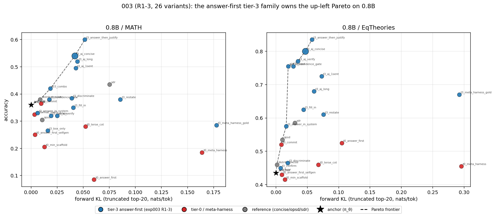

# 003: Answer-first gold injection beats the tier-5 ceiling on 0.8B; Meta-Harness loses

**Takeaway:** To push the 0.8B Pareto up-and-left, *how* and *where* you inject the gold answer matters far more than any prompt-engineering or scaffold. Across 3 rounds / 26 hand variants:

- **Default (best acc-per-nat): `t3_aj_concise`** — "solve concisely; state the gold answer first in the required format, then one line of justification." 0.8B/math ~0.54 @ KL .042, 0.8B/eq ~0.80 @ KL .05. Beats the tier-5 full- solution ceiling (`sdr`: math 0.44, eq 0.58) on **both** axes; triply replicated.
- **Max accuracy, KL not a constraint: `t3_answer_then_justify`** (same idea, unconstrained justification): math 0.55-0.60, eq 0.84-0.90.
- **Round 3 (10 variants) found no Pareto improvement** but two ablations pin the mechanism: (a) **position** — the same gold in the *system* prompt (`t3_answer_in_system`) is far worse than in the user turn (math 0.33 vs 0.60); (b) **structure vs leak** — answer-first *without* the gold (`t0_answer_first_selfgen`) is ≤ anchor (math 0.25). The gain is the correct-answer *injection*, not the answer-first *shape*.
- **Do not use Meta-Harness, or even a minimal 2-step scaffold, on a weak model.** `t0_meta_harness` 0.185 and `t0_min_scaffold` 0.205 on 0.8B/math (anchor 0.36) at high KL. It is not protocol complexity — any self-check derails a 0.8B model.
- **No tier-0 (no-leak) variant beat the existing `distrib:concise`.** Up-left gains are entirely tier-3 *framing*: "answer first, then justify" ≫ OPSD's "here is the answer, now produce reasoning" (+25pp math, +30pp eq at ≤ its KL).

## Setup

- **Goal:** hand-designed variant sweep to move the 0.8B (model, task) Pareto up-and-left (max accuracy at min KL), searching only tier-0 (problem-only) and tier-3 (this-problem's-gold-answer) condition families. Follow-on to [002](002_phase1_metric_matrix.md).
- **Model/tasks:** Qwen3.5-0.8B × {MATH-500 n=50 stratified, SAIR eq-theories n=50}, non-thinking. K=4 rollouts, v7 estimator stack (`prompt_logprobs=20`, truncated top-20 analytic KL `tk` as the axis; eager + no-prefix-cache + triton GDN — see [friction.md](../agent_notes/friction.md)).
- **π_θ anchor / references:** minimal-format anchor. Each run also evaluates `distrib:concise` (best tier-0 from 002), `opsd` (tier-3 answer-only), `sdr` (tier-5 full-solution ceiling) for frontier context.
- **Three iterations** (hand-designed, ~$1/round, 2 cells each):
  - **Round 1** (broad, 8 variants): tier-0 `t0_terse_cot` / `t0_answer_first` / `t0_format_strict` / `t0_meta_harness`; tier-3 `t3_answer_then_justify` (gold on line 1 + ≤2-sentence justify) / `t3_confirm` / `t3_meta_harness_gold` / `t03_combo` (concise system + gold). Meta-Harness ported from `connections-meta-harness` (propose→pick→execute→self-check→commit, single call).
  - **Round 2** (refine the R1 winner across the KL axis): `t3_box_only` (format the gold, no prose — degenerate ceiling), `t3_aj_long` (gold first + 5+ sentence justify — dilute per-token KL), `t3_aj_concise` (winner layered on the "solve concisely" prompt).
  - **Round 3** (10 variants, each a distinct hypothesis): answer-first refinements `t3_aj_verify` (check vs justify) / `t3_aj_1sent` (push KL below the knee) / `t3_restate` / `t3_confidence_gate` / `t3_fill_in`; ablations `t3_answer_in_system` (gold position) / `t3_discriminate` (choose vs assert); fresh tier-0 `t0_answer_first_selfgen` (structure-vs-leak) / `t0_min_scaffold` (minimal scaffold) / `t0_commit` (forced commitment).
- Builders in [`teacher_contexts.py`](../teacher_contexts.py) (`build_conditions_exp003{,r2,r3}`), driver `--cond-set exp003|exp003r2|exp003r3`.

## Result

Consolidated across rounds. Carried winners show the R3 numbers (R1/R2 in parens where they differ — stable). KL = `fwd_kl_tk`; `↓` = below that cell's anchor. Anchor: math 0.36, eq 0.44.

| condition | family | math acc | math KL | eq acc | eq KL |
|---|---|---:|---:|---:|---:|
| distrib:concise | ref t0 | 0.380 | .009 | 0.460 | .001 |
| opsd | ref t3 | 0.305 ↓ | .011 | 0.535 | .010 |
| sdr | ref t5 | 0.435 | .075 | 0.585 | .030 |
| **t3_aj_concise** | exp t3 | **0.540** (.56) | **.042** | **0.800** (.78) | **.047** |
| t3_answer_then_justify | exp t3 | 0.600 (.55) | .051 | 0.835 (.85-.90) | .057 |
| t3_aj_1sent (R3) | exp t3 | 0.495 | .043 | 0.725 | .073 |
| t3_aj_verify (R3) | exp t3 | 0.320 ↓ | .025 | 0.770 | .035 |
| t3_confidence_gate (R3) | exp t3 | 0.380 | .017 | 0.755 | .028 |
| t03_combo (R2) | exp t3 | 0.420 | .019 | 0.755 | .019 |
| t3_answer_in_system (R3) | exp t3 | 0.330 ↓ | .006 | 0.575 | .016 |
| t0_commit (R3) | exp t0 | 0.365 | .010 | 0.520 | .008 |
| t0_answer_first_selfgen (R3) | exp t0 | 0.250 ↓ | .004 | 0.430 ↓ | .009 |
| t0_min_scaffold (R3) | exp t0 | 0.205 ↓ | .013 | 0.415 ↓ | .014 |
| t0_meta_harness (R1) | exp t0 | 0.185 ↓ | .164 | 0.455 | .296 |

Degenerate `t3_box_only` (R2): eq 0.845 but response collapses to ~2 tokens (KL length-filtered); math *fails* 0.265 — told "output only \boxed{}", 0.8B rambles (ylen 738) and mangles the boxed string. Naive answer-copy is not viable on MATH; the justify step is load-bearing, not cosmetic.

**Strongest lever:** answer-first framing of the gold. Same tier-3 information as OPSD, but stating the answer *in the required format on line 1* before any reasoning lifts 0.8B/math from OPSD's 0.330 to 0.555 and 0.8B/eq from 0.535 to 0.775 — at equal or lower KL. The model commits to the correct answer before it can talk itself out of it; the short, anchored response also keeps KL low.

**Vs literature / 002:** in 002 the 0.8B Pareto-top was tier-5 `sdr` (math 0.44, eq 0.57) and tier-3 `opsd`/`sdpo` underperformed engineered prompts. 003 shows that was an artifact of the *injection framing*, not the information tier: re-framed tier-3 (`t3_aj_concise`) dominates `sdr` on both axes for both tasks. The connections-meta-harness result that an evolved protocol scaffold helps does **not** transfer to a 0.8B inner model on a single call.

## Key findings

1. **Answer-first ≫ answer-then-reason.** Identical tier-3 info; framing alone is +25pp (math) / +30pp (eq) over OPSD at ≤ its KL. Triply replicated (R1-3).
2. **`t3_aj_concise` is the recommended up-left point** — ≈ max accuracy at the lowest KL among non-degenerate variants; beats the tier-5 ceiling on both axes.
3. **It's the leak, not the shape** (R3 ablation). Answer-first *structure* without the gold (`t0_answer_first_selfgen`) is ≤ anchor (math 0.25, eq 0.43). The 003 gain is entirely the injected correct answer.
4. **Position matters** (R3 ablation). Same gold in the *system* prompt (`t3_answer_in_system`) ≪ in the user turn (math 0.33 vs 0.60; eq 0.58 vs 0.84).
5. **Any scaffold derails 0.8B**, not just the full protocol: `t0_meta_harness` 0.185 *and* the minimal 2-step `t0_min_scaffold` 0.205 on math (anchor 0.36).
6. **Degenerate answer-copy (`t3_box_only`) only works on eq** (binary, trivial to emit). On MATH it fails (0.265) — boxed-expression fidelity needs the derivation; the justify step is load-bearing.
7. **No tier-0 idea beat `distrib:concise`** across 3 rounds; "verify" vs "justify" second-step framing is task-dependent (justify wins math, verify competitive on eq) but neither moves the frontier.

## Navigation

- [`002_phase1_metric_matrix.md`](002_phase1_metric_matrix.md) — the 6-cell tier matrix this refines for 0.8B.
- [`teacher_contexts.py`](../teacher_contexts.py) `build_conditions_exp003{,r2,r3}` (11 / 8 / 15 conds); driver `--cond-set`.
- [`agent_notes/lessons.md`](../agent_notes/lessons.md) — answer-first ≫ answer-then-reason; meta-harness-fails-on-weak-model; KL-estimator + vLLM workarounds carried from 002.
- `results/phase1/phase1__Qwen__Qwen3.5-0.8B__{math,eqtheories}__*.json` (exp003, exp003r2, exp003r3 runs).

## Appendix

Date: 2026-05-16 Commit: 4c46fa1 (+ exp003 builders, `--cond-set` uncommitted) Status: complete; 3 iterations (R1 broad, R2 KL-axis refine, R3 10 hypothesis variants). R3 found no Pareto improvement but pinned the mechanism (position, structure-vs-leak ablations); further rounds not warranted — winner triply replicated, frontier stable. Command: `modal run --detach modal_phase1.py --model Qwen/Qwen3.5-0.8B --task {math,eqtheories} --n 50 --k 4 --topk 20 --cond-set {exp003,exp003r2,exp003r3}` n: 50 problems × 8-15 conditions × K=4 × 2 cells × 3 rounds (~26 distinct variants). acc SE ≈ 0.035 (binomial, n=200). Compute: ~6 H100-hr across R1-3 (+ retries: a demos_pool kwarg bug caught at first condition build, one 0.8B/math vLLM hang — the known Qwen3.5 deadlock). ≈ $6. Significance: `t3_answer_then_justify` replicates across R1/R2/R3 (math 0.55/0.56/0.60, eq 0.90/0.85/0.835); answer-first vs OPSD (+25/+30pp) and the structure-vs-leak / position ablations are ≫ the 0.035 acc SE.
