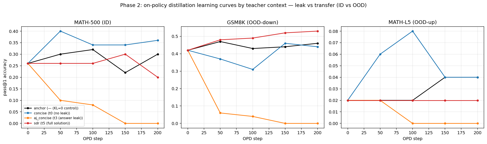

# 004: The 003 Pareto winner is the *worst* OPD teacher — answer-leak collapses the student

> **⚠️ CORRECTION (see [005](005_opd_recipe_ablation.md)).** The "catastrophic
> collapse / structural inversion (ρ≈−0.8)" framing below is **overstated**. A
> recipe ablation showed the collapse is a **trust-region artifact**: with
> `reverse_kl` + a KL-to-base anchor, `aj_concise` does not collapse (ID
> 0.26→0.42). `forward_kl` collapses *both* teachers (a red herring). The
> *surviving, corrected* result: the 003 answer-leak advantage **does not
> transfer to OPD** — stabilized `aj_concise` only *ties* no-leak `concise`
> (and loses OOD-down). H3 fails as a **null, not an inversion**. Read 004 as
> the raw single-recipe runs; read [005](005_opd_recipe_ablation.md) for the
> corrected conclusion.

**Takeaway:** On-policy distillation (reverse-KL, same model as student & teacher) does **not** inherit the 003 single-call Pareto. Across the 4 teacher contexts spanning 003's frontier, OPD effectiveness is **inverted** w.r.t. 003 accuracy (Spearman ρ ≈ **−0.8**, n=4):

- **Only the no-leak teacher transfers.** `concise` (003 tier-0, *weaker* on 003 accuracy) is the single context that gives a stable, OOD-safe lift: 0.8B/MATH **0.26 → 0.36 (peak 0.40 @ step 50)**, GSM8K and MATH-L5 held or up. This is genuine transfer — the student reproduces the behavior without privileged info.
- **The 003 winner is catastrophic.** `aj_concise` (003's recommended up-left point, answer-leak) **collapses the student to 0** on every eval set (ID 0.26→0, GSM8K 0.42→0, entropy 0.54→0.02). The behavior that wins a single call is destructive as an OPD target.
- **More leak ≠ more harm.** `sdr` (full gold solution, *more* leak than `aj_concise`) does **not** collapse: ID flat within noise, and a clean **GSM8K +0.11** (0.42→0.53). The collapse is driven by teacher *peakedness*, not leak magnitude.
- **Control valid.** `anchor` (teacher==student, KL≡0, loss≡0 every step) is flat within n=50 noise — the collapse is teacher-driven, not a pipeline artifact.

**Decision:** SPEC **H3 is refuted (and inverted)** at the 0.8B self-distillation scope: a teacher's same-model Pareto position is anti-predictive of its OPD value. For OPD teacher selection, prefer **no-leak distributional teachers**; answer-first concise leak teachers are actively harmful. The Phase-1 "answer-leak pathology" (π_T near-1 on the gold token) and this Phase-2 collapse are the **same mechanism** — see [lessons.md](../agent_notes/lessons.md).

## Setup

- **Goal:** test whether a teacher context's 003 single-call Pareto position predicts its value as an OPD teacher (SPEC H3), at the *same* 0.8B base (so the 002/003 measurement and the OPD test share π_θ).
- **Method:** on-policy distillation ported verbatim from [`explore/147_on_policy_distillation.py`](../../explore/147_on_policy_distillation.py) (`reverse_kl`, student.generate → teacher fwd on context+rollout → student fwd on bare anchor+rollout → KL on response tokens only). Same model is student and teacher (no vLLM weight-sync). Student prompt = the bare 002/003 anchor (problem only); the gold answer/solution reaches **only** the teacher forward, never the student or eval (asserted leak-free locally).
- **Model:** Qwen/Qwen3.5-0.8B (exact 002/003 base). 4 teachers, each a fresh student from base:

  | run | teacher context | tier | 003 0.8B/math acc |
  |---|---|---:|---:|
  | `anchor` | none (teacher==student) | — control | 0.36 |
  | `concise` | `distrib:concise` | t0 no-leak | 0.38 |
  | `aj_concise` | `t3_aj_concise` (003 winner) | t3 answer-leak | 0.54 |
  | `sdr` | full gold solution | t5 full-solution | 0.44 |

- **Eval:** ID = held-out MATH-500 (n=50, stratified); OOD-down = GSM8K (n=100); OOD-up = MATH-L5 held-out (n=50). Greedy, student/anchor prompt only, eval at steps {0,50,100,150,200}.
- **Hyperparams:** `reverse_kl`, lr 1e-6 (cosine, 10 warmup), bs 4, n_train 2964 (MATH train, hendrycks_math, level-stratified; disjoint from MATH-500 and the L5 test eval), N_STEPS 200, MAX_NEW **512**, temp 0.7. Driver: [`modal_phase2.py`](../modal_phase2.py).

## Result

```
teacher     tier               eval                base  final      Δ   peak  peak@  ½-lift@
anchor      — (KL≈0 control)   MATH-500 (ID)      0.260  0.300  +0.040 0.320   100      50
anchor      — (KL≈0 control)   GSM8K (OOD-down)   0.420  0.460  +0.040 0.470    50      50
anchor      — (KL≈0 control)   MATH-L5 (OOD-up)   0.020  0.040  +0.020 0.040   150     150
concise     t0 (no leak)       MATH-500 (ID)      0.260  0.360  +0.100 0.400    50      50
concise     t0 (no leak)       GSM8K (OOD-down)   0.420  0.440  +0.020 0.460   150     150
concise     t0 (no leak)       MATH-L5 (OOD-up)   0.020  0.040  +0.020 0.080   100      50
aj_concise  t3 (answer leak)   MATH-500 (ID)      0.260  0.000  -0.260 0.260     0       —
aj_concise  t3 (answer leak)   GSM8K (OOD-down)   0.420  0.000  -0.420 0.420     0       —
aj_concise  t3 (answer leak)   MATH-L5 (OOD-up)   0.020  0.000  -0.020 0.020     0       —
sdr         t5 (full solution) MATH-500 (ID)      0.260  0.200  -0.060 0.300   150       —
sdr         t5 (full solution) GSM8K (OOD-down)   0.420  0.530  +0.110 0.530   200      50
sdr         t5 (full solution) MATH-L5 (OOD-up)   0.020  0.020  +0.000 0.020     0       —
```



`aj_concise` collapse signature: entropy 0.54→~0.02, eval monotone 0.26→0.10→0.08→0→0, with a transient window (steps ~75-100) of near-empty 1-second generations before the model settled into a degenerate low-entropy mode. `anchor` printed `loss=0.00000` every step (teacher==student → KL≡0); its ±0.06 ID wander is within the n=50 binomial SE.

**SPEC H3 (Spearman[003-Pareto rank, OPD ID-Δ] > 0.6):** observed ρ ≈ **−0.8** (n=4: 003-acc order aj_concise>sdr>concise>anchor vs OPD-Δ order concise>anchor>sdr>aj_concise). The relationship is not weak — it is *inverted*: the single-call Pareto winner is the OPD worst.

## Key findings

1. **003 Pareto position is anti-predictive of OPD value (H3 refuted, inverted).** What makes a teacher win a single forward call (answer stated first, ultra-concise) makes it a pathological on-policy distillation target.
2. **No-leak `concise` is the only safe + beneficial OPD teacher** (+0.10 ID, peak +0.14 @ step 50; OOD held). This is the genuine-transfer case the plan hypothesized — the student reproduces the behavior without the privileged context.
3. **Collapse is driven by teacher peakedness, not leak magnitude.** `aj_concise` (answer + "one concise line" → a ~10-token, near-deterministic teacher) collapses the answer-blind student under mode-seeking reverse-KL. `sdr` leaks *more* (full solution) but its teacher is verbose/higher-entropy → no collapse, even a GSM8K gain. This refines the plan's flat "leak vs transfer" hypothesis into a peakedness story.
4. **Mechanism unifies Phase 1 and Phase 2.** The Phase-1 KL-estimator pathology (answer-leak teacher π_T≈1 on the gold token, fat negative log-ratio tail — [lessons.md](../agent_notes/lessons.md)) is the *same* peaked distribution that, used as an OPD target, collapses the student. Answer-leak teachers are pathologically peaked, full stop.
5. **`sdr`'s GSM8K +0.11 is a real OOD-down effect**, plausibly because distilling toward a teacher that emits full worked solutions encourages longer structured reasoning that helps easier grade-school problems even without the answer. Worth a follow-up if OPD-from-solution-teachers becomes a direction.

## Caveats

- **MAX_NEW 512** (down from the plan's 1024; `torch.compile` is infeasible on Qwen3.5 — linear-attention static-cache crash, [friction.md](../agent_notes/friction.md)). Truncation deflates absolute MATH acc (base ID 0.26 here vs 0.40 at 1024) but is identical across all 4 teachers, so the cross-teacher comparison — the result — is unaffected.
- **n=50 ID/L5, n=100 GSM8K, 1 seed/teacher.** SE ≈ 0.07/0.07/0.05. `anchor`/`sdr` ID fluctuations are within noise; the `aj_concise` collapse (−0.26 to exactly 0) and `concise` lift (+0.10, replicated across 4 of 5 eval points) are ≫ SE. Spearman is n=4 (directional, not significant) — but the best→worst inversion is categorical, not marginal.
- **MATH-L5 is at the 0.8B floor** (0.02-0.08); report it but do not lean on it for the OOD-up claim.
- **Collapse magnitude (exactly 0) is likely recipe-sensitive** (reverse-KL mode-seeking, lr 1e-6, no KL-to-base anchor, on-policy). Robust claims: the leak-vs-transfer *ordering*, the H3 *inversion*, and *peakedness as the collapse driver*. A KL-to-base regularizer or forward-KL would likely soften the collapse — a natural follow-up, not required for this conclusion.

## Navigation

- [`003_0p8b_answer_first_upleft.md`](003_0p8b_answer_first_upleft.md) — the single-call Pareto whose winner (`aj_concise`) this shows is the OPD worst.
- [`002_phase1_metric_matrix.md`](002_phase1_metric_matrix.md) — tier matrix + SPEC H3 origin.
- [`modal_phase2.py`](../modal_phase2.py) (147-ported OPD, 4-teacher dispatch), [`analyze_phase2.py`](../analyze_phase2.py) (`--pull --plot`).
- [`agent_notes/lessons.md`](../agent_notes/lessons.md) — answer-leak peakedness unifies Phase-1 KL pathology and Phase-2 OPD collapse; [`agent_notes/friction.md`](../agent_notes/friction.md) — Qwen3.5 compile incompatibility.
- `results/phase2/phase2__{anchor,concise,aj_concise,sdr}.json`.

## Appendix

Date: 2026-05-16. Status: complete; hypothesis resolved (refuted + inverted) and refined (peakedness). 4 runs × 1 seed, ~1.6 H100-hr each (uncompiled HF generate; compile infeasible on Qwen3.5). Cost ≈ $20-25 incl. a dry-run + 1 canary (the canary caught the compile crash before the 4-run batch — staged rollout paid for itself). Command: `modal run --detach modal_phase2.py --teacher {anchor,concise,aj_concise,sdr}`; analysis `python analyze_phase2.py --pull --md` + `uv run --no-project --with matplotlib python analyze_phase2.py --plot`. Significance: `aj_concise` collapse and `concise` lift ≫ the ~0.07 ID SE and replicate across eval points; H3 Spearman ρ≈−0.8 is n=4 directional but a categorical best→worst inversion. Deviations from plan.md: MAX_NEW 1024→512, N_STEPS 250→200 (plan §step-6 sanctioned fallback; compile route closed by the Qwen3.5 linear-attention crash).
