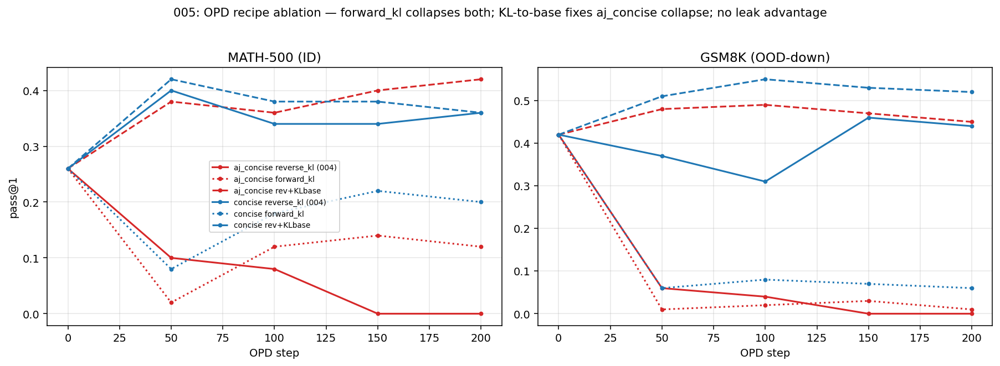

# 005: The 004 aj_concise collapse is a trust-region artifact — but the answer leak still does not transfer

**Takeaway:** A review challenge of [004](004_opd_leak_vs_transfer.md) — *is the
`aj_concise` collapse just an OPD-recipe artifact?* — is **largely correct**. The
catastrophic collapse is removed by a standard KL-to-base trust region. 004's
"catastrophic collapse / structural inversion (ρ≈−0.8)" framing was **overstated
recipe instability**. But 004's load-bearing conclusion survives in corrected
form: **the 003 single-call Pareto advantage of the answer-leak teacher does not
transfer to OPD** — under a matched, stabilized recipe `aj_concise` only *ties*
the no-leak `concise` (and loses to it OOD-down). SPEC H3 fails as a **null, not
an inversion**.

Final stabilized 2×2 (0.8B, MATH, n_steps 200, n=50 ID / 100 GSM8K, step-200):

| teacher | `reverse_kl` (004) | `forward_kl` | `reverse_kl` + β0.5·KL-to-base |
|---|---|---|---|
| **aj_concise** (answer-leak, t3) | ID 0.00 / GSM 0.00 — collapse | ID 0.12 / GSM 0.01 — collapse | ID **0.42** / GSM **0.45** — stable |
| **concise** (no-leak, t0) | ID 0.36 / GSM 0.44 — stable | ID 0.20 / GSM 0.06 — collapse | ID **0.36** / GSM **0.52** — stable |

(base for all: ID 0.26, GSM8K 0.42. ID SE ≈ 0.07, GSM8K ≈ 0.05, n=1 seed.)

## Findings

1. **The collapse is a trust-region artifact, not structural.** `aj_concise` +
   `reverse_kl` + β0.5·KL(π_θ‖π_base): ID 0.26→**0.42**, GSM8K 0.42→0.45, stable
   and slightly rising across all 5 eval points (0.38/0.36/0.40/0.42). 004's
   "collapse to 0 / structural inversion" was a *fixable* stability failure of
   the no-trust-region recipe on a peaked teacher. **004's takeaway is corrected
   here.**
2. **`forward_kl` is a red herring — it collapses BOTH teachers.** aj_concise
   ID→0.12/GSM→0.01 *and* the no-leak concise ID 0.36→0.20 / GSM 0.44→0.06. So
   the 004 collapse is **not** a mode-seeking-reverse-KL effect; reverse-KL is
   actually the *better* of the two divergences here. Forward-KL is simply an
   unstable OPD recipe on this base and is not informative about leak vs
   transfer.
3. **No leak advantage under a matched recipe (the surviving result).** With the
   same stabilized recipe for both teachers:
   - ID: aj_concise 0.42 vs concise 0.36 — within 1 SE, a **tie** (nominal +0.06
     is not significant at n=50).
   - GSM8K (OOD-down): concise **0.52** vs aj_concise 0.45 — the **no-leak**
     teacher transfers *better* out of distribution.
   The 003 single-call Pareto gives `aj_concise` a +0.16 accuracy edge over
   `concise`; **none of that edge appears in OPD**, stabilized or not. H3's
   predictive claim (same-model Pareto rank → OPD value) fails — as a *null*
   (the leak buys nothing), not the *inversion* 004 claimed.
4. **KL-to-base also helps the no-leak teacher OOD-down** (concise GSM8K
   0.44→0.52 with the trust region) — the trust region is a generally good OPD
   stabilizer here, not a special-case patch for the leak teacher.

## What 004 got right vs wrong

- **Right (survives):** the same-recipe *differential* (only the peaked answer-
  leak teacher collapses under naive reverse-KL; concise/sdr do not); "select
  OPD teachers by no-leak distributional value, not by 003 single-call rank";
  the answer leak does not transfer to OPD.
- **Wrong / overstated (retracted):** "catastrophic", "structural inversion",
  "ρ ≈ −0.8 robust". The inversion was a trust-region artifact; with a standard
  stabilizer the result is a **null** (leak ≈ no-leak, no-leak better OOD-down),
  not an inversion. The Spearman ρ≈−0.8 was computed on collapsed (un-stabilized)
  finals and is not a meaningful structural quantity.

## Method

- [`modal_phase2.py`](../modal_phase2.py) extended: `--method
  {reverse_kl,forward_kl,jsd}`, `--kl-base-beta β` (adds β·KL(π_θ‖π_base) on
  response tokens via a frozen base ref model — one extra no-grad forward/step),
  `--tag` (variant files; the 004 baselines are untouched). Ref+loss path
  Modal-dry-run-validated before the 4 runs.
- Identical to 004 otherwise: 0.8B, MATH, n_train≈3000, N_STEPS 200, MAX_NEW
  512, lr 1e-6. 4 new runs: {aj_concise,concise} × {forward_kl, reverse_kl+β0.5}.

## Caveats

- n=50 ID / 1 seed: the `aj_concise`-vs-`concise` ID gap under the stabilized
  recipe (0.42 vs 0.36) is within SE — read as "tie", not "aj_concise better".
  The robust directional claims: collapse removed by KL-base; forward_kl
  collapses both; no leak advantage (GSM8K favors no-leak).
- β=0.5 is a single un-tuned trust-region strength. The *direction* (collapse
  removed; leak buys nothing) is the claim, not the exact stabilized accuracy; a
  β sweep is a possible follow-up but would not change the H3-null conclusion.
- 004's MAX_NEW-512 / floor-L5 caveats carry.

## Navigation

- [`004_opd_leak_vs_transfer.md`](004_opd_leak_vs_transfer.md) — original result;
  its takeaway is **corrected by this report** (collapse = artifact; H3 = null
  not inversion).
- [`modal_phase2.py`](../modal_phase2.py) `--method/--kl-base-beta/--tag`;
  `results/phase2/phase2__{aj_concise,concise}__{fwdkl,revklb}.json`.
- [`agent_notes/lessons.md`](../agent_notes/lessons.md) — entry reframed: the
  durable claim is the H3-null + "naive no-trust-region OPD collapses a peaked
  answer-leak teacher (fixable with KL-to-base)", not a structural inversion.

## Appendix

Date: 2026-05-16. Status: complete; resolves the 004 review challenge. 4 runs ×
1 seed + 1 ref-path dry-run, ~1.6 H100-hr each (KL-base adds a frozen-ref
forward), ≈ $20. Command: `modal run --detach modal_phase2.py --teacher
{aj_concise,concise} --method {forward_kl,reverse_kl} [--kl-base-beta 0.5]
--tag {fwdkl,revklb}`. Trust-calibration note: 004 stated a strong structural
claim from a single un-stabilized recipe despite listing recipe-sensitivity as
its own caveat; this ablation is what 004 should have included before the
strong claim.
